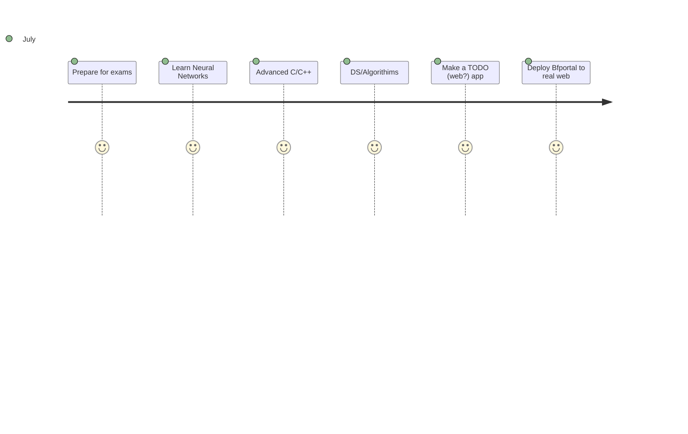

>Technology is nothing. What's important is that you have a faith in people, that they're basically good and smart, and if you give them tools, they'll do wonderful things with them. -Steve Jobs
***
### Currenty I am 
- Trying to go to college 😢
- Trying to maintain a journal 🙂
- Working on Bfportal, BFReport, Nwidgets 🧑‍🏭

&nbsp;    
&nbsp;   
&nbsp;  
&nbsp; &nbsp;   
&nbsp;   
&nbsp;   
&nbsp;   
&nbsp;   &nbsp;   &nbsp;   &nbsp;   &nbsp;  &nbsp;   &nbsp;   &nbsp;   &nbsp;   &nbsp;  &nbsp;   &nbsp; &nbsp;   
&nbsp;   
&nbsp;   
&nbsp;  
&nbsp;  &nbsp;   
&nbsp;   
&nbsp;   
&nbsp;
[gala](https://discord.com/users/338947895665360898) on Discord
## Things I aim to Complete in 2022 :- 

