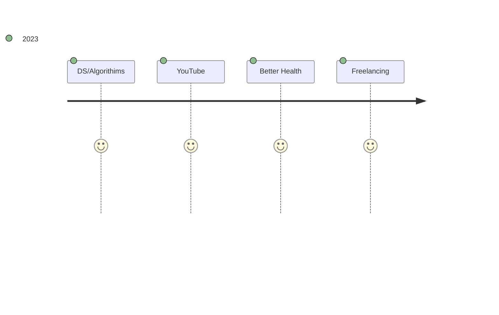

>Technology has to be invented or adopted. -Jared Diamond
***
<h1 align="center">Hi 👋, I'm Vibhakar Solanki</h1>
<h3 align="center">A passionate full stack developer, learning data science and AI these days</h3>

  

- Intern at [@LetsDive](https://github.com/DiveHQ)
  
- 🔭 I’m currently working on [Battlefield Portal Library](https://github.com/battlefield-portal-community/bfportal.gg)

- 🌱 I’m currently learning **Deep Learning and Rust**

- 👨‍💻 All of my projects are available at [vibhakar.dev](vibhakar.dev)

- 📝 I regularly write articles on [stilllearning.tech](stilllearning.tech)

- 💬 Ask me about **Django and Backend development**

- 📫 How to reach me **gala_vs**

<h3 align="left">Connect with me:</h3>

<h3 align="left">Languages and Tools:</h3>

                                        

<h3 align="left">Support:</h3>

  

 

  

