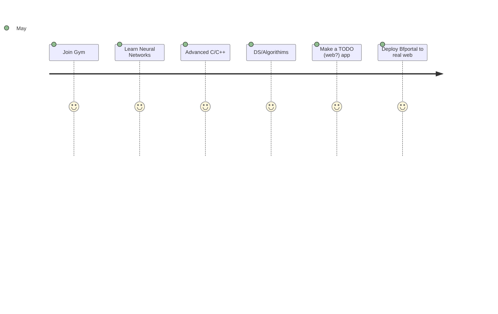

>Technology presumes there's just one right way to do things and there never is. -Robert M. Pirsig
***
### Currenty I am 
- Trying to go to college 😢
- Trying to maintain a journal 🙂
- Working on Bfportal, BFReport, Nwidgets 🧑‍🏭

     
    
   
      
    
    
    
                                                
    
    
   
       
    
    
 
[gala](https://discord.com/users/338947895665360898) on Discord
## Things I aim to Complete in 2022 :- 

